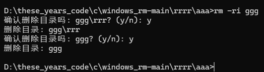
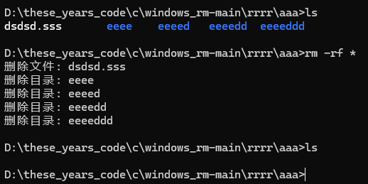
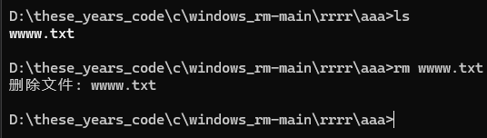
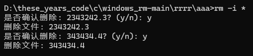

# windows_rm

## 参数指南（记得要给本程序创建环境变量）

### -r	递归删除目录及其内容

### -f	强制删除，不提示确认

### -i	交互式删除，每次删除前提示确认

### --version     显示版本信息并退出

### --help     显示此帮助信息并退出

## 演示

```bash
rm -rf
```


```bash
rm -ri （直接回车默认为n）
```



```bash
rm -rf *
```



```bash
rm
```



```bash
rm -i *
```


